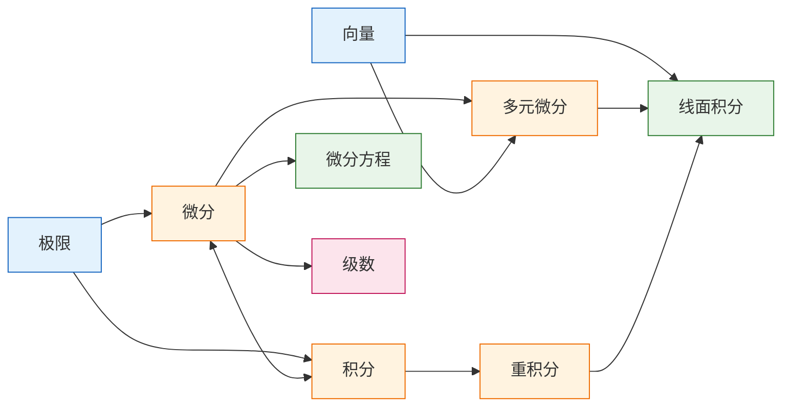

---
up:
related:
date: 2026-02-11
---
---
### 第一部分：高等数学知识地图 

**图例说明（知识点类型）：**
*   【概念】：基础定义、性质
*   【计算】：运算法则、求解方法
*   【定理】：核心理论、公式
*   【应用】：物理/几何应用、综合分析

#### 第一卷：一元微积分基础

| 教学主题 (Chapter) | 知识点 (KP) | 知识点内容 (Content Terms) | 知识点类型 |
| :--- | :--- | :--- | :--- |
| **Ch1 函数与极限** | **数列与函数极限** | ε-N/ε-δ定义, 收敛性质, 海涅定理, 左右极限 | 【概念】 |
| | **极限运算** | 四则运算, 复合运算, 两个重要极限, 夹逼准则 | 【计算】 |
| | **无穷小分析** | 比阶(高/低/同), 等价无穷小替换, 泰勒展开首项 | 【计算/概念】 |
| | **连续性** | 间断点分类, 闭区间连续性质(介值/最值) | 【概念/定理】 |
| **Ch2 导数与微分** | **导数定义** | 瞬时变化率, 切线斜率, 可导与连续关系 | 【概念】 |
| | **求导法则** | 链式法则, 反函数求导, 隐函数/参数方程求导 | 【计算】 |
| | **微分** | 线性主部, dy=f'(x)dx, 近似计算 | 【概念/应用】 |
| **Ch3 中值定理** | **核心定理** | 罗尔定理, 拉格朗日(f'ξ), 柯西, 泰勒公式 | 【定理】 |
| | **洛必达法则** | 0/0型, ∞/∞型, 幂指函数转化 | 【计算】 |
| | **函数性态** | 单调性, 极值/最值, 凹凸性, 拐点, 渐近线 | 【应用】 |
| **Ch4 不定积分** | **积分法** | 换元法(凑微分/三角/倒数), 分部积分 | 【计算】 |
| | **特殊函数积分** | 有理函数拆分, 三角有理式万能公式 | 【计算】 |
| **Ch5 定积分** | **定义与基本定理** | 黎曼和, 牛顿-莱布尼茨公式, 变上限积分求导 | 【定理/概念】 |
| | **反常积分** | 无穷限积分, 瑕积分, Γ函数 | 【概念/计算】 |
| **Ch6 定积分应用** | **几何与物理** | 面积, 旋转体体积, 弧长, 变力做功, 质心 | 【应用】 |
| **Ch7 微分方程** | **一阶与降阶** | 可分离变量, 齐次, 一阶线性, 伯努利 | 【计算】 |
| | **二阶线性** | 特征方程法, 待定系数法, 欧拉方程 | 【计算】 |

#### 第二卷：多元微积分与级数

| 教学主题 (Chapter) | 知识点 (KP) | 知识点内容 (Content Terms) | 知识点类型 |
| :--- | :--- | :--- | :--- |
| **Ch8 向量与空间** | **向量代数** | 点乘(数量积), 叉乘(向量积), 混合积 | 【计算】 |
| | **空间几何** | 平面方程, 直线方程, 二次曲面分类 | 【概念/计算】 |
| **Ch9 多元微分** | **多元导数** | 偏导数, 全微分, 链式法则, 梯度 | 【概念/计算】 |
| | **多元极值** | 无条件极值(Hessian), 条件极值(拉格朗日乘数) | 【应用】 |
| **Ch10 重积分** | **二重/三重积分** | 直角坐标(X/Y型), 极/柱/球坐标变换 | 【计算】 |
| **Ch11 线面积分** | **曲线积分** | 第一类(弧长), 第二类(向量场/做功) | 【计算】 |
| | **曲面积分** | 第一类(面积), 第二类(通量) | 【计算】 |
| | **场论公式** | 格林公式, 高斯公式, 斯托克斯公式 | 【定理】 |
| **Ch12 无穷级数** | **常数项级数** | 比值/根值/积分判别法, 交错级数 | 【概念/计算】 |
| | **幂级数** | 收敛半径, 泰勒/麦克劳林级数展开 | 【计算/应用】 |
| | **傅里叶级数** | 周期延拓, 正弦/余弦级数 | 【应用】 |

---

### 第二部分：逻辑结构关系图谱 

根据知识点间的内在逻辑，我们将关系划分为6类。
#### 1. 整部关系 
*定义：章节与知识点、知识点与具体术语的包含关系。*

*   **微积分学 (Whole) 包含**：
    *   极限论 (Ch1, Ch12)
    *   微分学 (Ch2, Ch3, Ch9)
    *   积分学 (Ch4, Ch5, Ch6, Ch10, Ch11)
    *   微分方程 (Ch7)
    *   解析几何 (Ch8)
*   **Ch1 函数与极限 包含**：数列极限、函数极限、连续性。
*   **间断点 包含**：第一类间断点（可去、跳跃）、第二类间断点（无穷、振荡）。
#### 2. 属种关系 
*定义：一般概念与具体特例的关系。*

*   **积分 (Genus)**：
    *   *Species*: 不定积分 (函数族)、定积分 (数值)、反常积分 (极限值)、二重积分 (体积/质量)、曲线积分 (场效应)。
*   **导数 (Genus)**：
    *   *Species*: 普通导数 $dy/dx$、偏导数 $\partial z/\partial x$、方向导数 $\partial f/\partial l$。
*   **级数 (Genus)**：
    *   *Species*: 几何级数、P-级数、调和级数、泰勒级数、傅里叶级数。
#### 3. 递进关系
*定义：学习顺序上的深入，后一个知识点是前一个的推广或深化。*

*   **极限 $\to$ 导数 $\to$ 积分**：
    *   先学“极限”定义，以此定义“瞬时变化率（导数）”，再利用“黎曼和的极限”定义“定积分”。
*   **一元 $\to$ 多元**：
    *   一元导数 (Ch2) $\to$ 多元偏导数 (Ch9)。
    *   定积分 (Ch5) $\to$ 二重积分 (Ch10) $\to$ 三重积分。
    *   区间上的积分 $\to$ 曲线积分 (Ch11) $\to$ 曲面积分。
*   **泰勒公式 (Ch3) $\to$ 泰勒级数 (Ch12)**：
    *   由有限项的多项式逼近，递进为无穷项的级数表达。
#### 4. 依赖关系 
*定义：A是B的基础工具，没有A无法解决B。*

*   **极限 $\xrightarrow{依赖}$ 连续性/导数**：没有极限就没有连续和可导的定义。
*   **导数 $\xrightarrow{依赖}$ 罗尔/拉格朗日中值定理**：中值定理是导数性质的推论。
*   **导数 $\xrightarrow{依赖}$ 洛必达法则**：洛必达法则利用导数比值来求极限。
*   **向量代数 (Ch8) $\xrightarrow{依赖}$ 空间解析几何 & 多元微积分**：法向量、切向量的计算依赖点乘和叉乘。
*   **积分技巧 (Ch4) $\xrightarrow{依赖}$ 微分方程求解 (Ch7)**：解方程本质上是寻找原函数的过程。
#### 5. 共生关系
*定义：两个概念互为逆运算，或经常成对出现，物理意义互补。*

*   **微分 $\Leftrightarrow$ 积分 (互逆)**：
    *   通过 **牛顿-莱布尼茨公式** 连接。微分是切分，积分是累加。
*   **格林公式/高斯公式/斯托克斯公式 $\Leftrightarrow$ 微积分基本定理**：
    *   它们都是微积分基本定理在高维空间的共生形式（边界上的积分等于区域内部的微分）。
*   **旋度 & 散度**：
    *   在场论中常共生，一个描述旋转强度，一个描述源汇强度。
#### 6. 互斥关系
*定义：在特定语境下，两个状态或性质不可能同时成立。*

*   **收敛 vs 发散**：
    *   一个级数或反常积分，要么收敛，要么发散，绝无第三种状态。
*   **连续 vs 间断**：
    *   在同一点处，函数不可能既连续又间断。
*   **无关 vs 相关**：
    *   线性代数或微分方程解的结构中，函数组要么线性相关，要么线性无关。

---
好的，我来把所有图都缩小，采用更紧凑的设计。

---

## 高等数学知识图谱

### 一、全局架构

---

